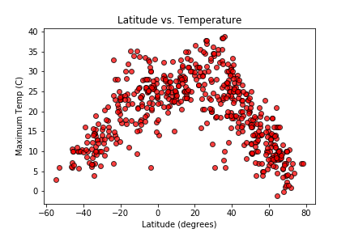
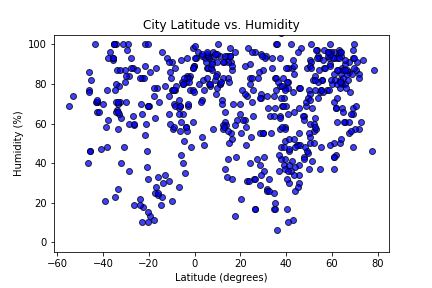
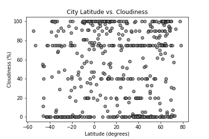
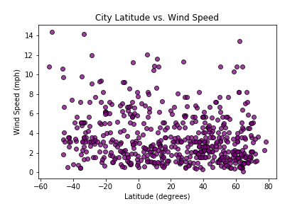
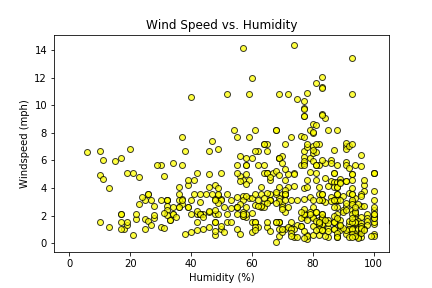

# What's the Weather Like?

## WeatherPy

I created a Python script to visualize the weather of 500+ cities across the world of varying distance from the equator. 
To accomplish this, I utilized (https://pypi.python.org/pypi/citipy) and the [OpenWeatherMap API](https://openweathermap.org/api)
The data was read in JSON format, and created to dataframes for further data wrangling and plotting. 

I produced a series of scatter plots to showcase the following relationships:

* Temperature (F) vs. Latitude

* Humidity (%) vs. Latitude

* Cloudiness (%) vs. Latitude

* Wind Speed (mph) vs. Latitude

Additionally, I examined the scatter-plot correlation between cloudiness and humidity (positive correlation) and wind speed vs. humidity (negative correlation.

